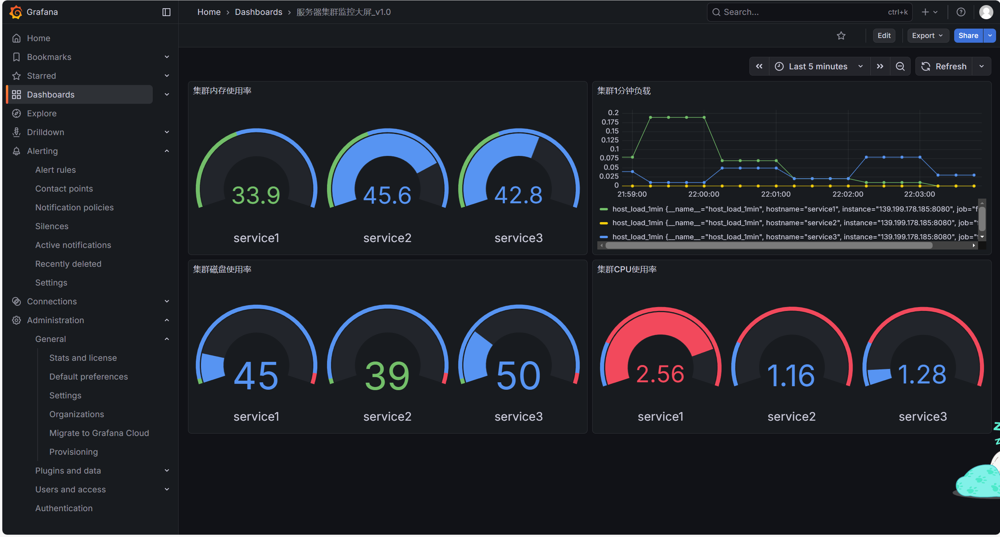
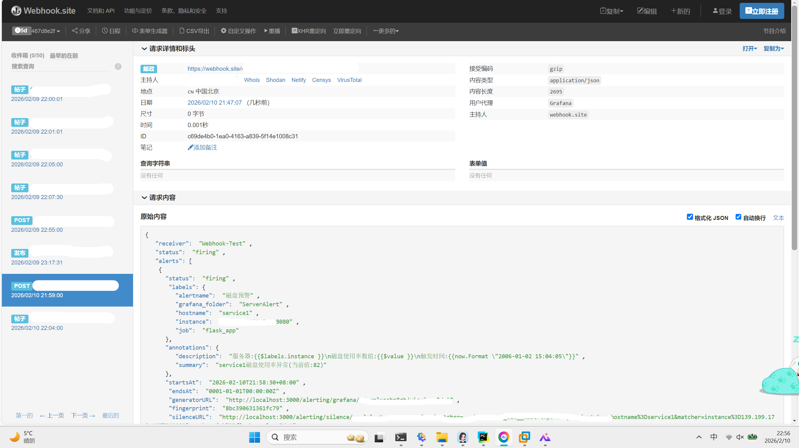

# 全栈式运维监控平台

## 项目介绍
my-monitoring-app 是一个全栈运维监控平台，基于 Ansible 实现多台虚拟机的自动化指标采集，通过 Prometheus 统一存储时序数据，
并利用 Grafana 提供实时可视化和 Webhook 告警能力。后端采用 Flask 构建 REST API，打通配置分发与告警接收链路。

## 项目运行效果展示
|               集群全局监控可视化大屏                |           服务器磁盘使用率超限告警            |
|:----------------------------------------:|:---------------------------------:|
|  |  |

## 设计亮点

- **安全通信设计**：基于反向 SSH 隧道打通无公网 IP 场景下的监控链路，监控端口零暴露于公网，降低攻击面。
- **架构选型升级**：以 Ansible 替代 Paramiko 实现多机并发采集与容错重试，以 Prometheus TSDB 替代传统 CSV 文件存储，支持实时查询与历史回溯。
- **生产级交付**：项目在真实云服务器环境长期运行，配套架构图、部署文档与排障手册，遵循 MIT 协议开源，可直接复现与二次开发。

## 目录结构
```plaintext
my-monitoring-app/
├── README.md                # 项目总览
├── changelog.md             # 版本更新记录
├── license.md               # 许可证
├── docs/                    # 详细文档
│   ├── deployment-guide.md  # 部署步骤
│   ├── docker-compose.yml   # docker部署文件
│   ├── user-manual.md       # 大屏操作/告警配置手册
│   ├── possible_problems.md # 常见问题
│   └── architecture/        # 架构相关
│       └── arch.png         # 极简架构图
├── ansible/                 # 多机指标采集
│   ├── multiple_date.yml    # Ansible剧本
│   └── inventory/           # 主机配置
│       └── hosts.ini        # 采集主机
├── prometheus/              # 指标存储
│   └── prometheus.yml       # Prometheus配置
├── flask-backend/           # 指标暴露接口
│   ├── app.py               # Flask入口
│   ├── requirements.txt     # 依赖
│   └── Dockerfile           # 构建 Flask 监控镜像   
├── grafana/                 # 大屏+告警
│   ├── alarm.md             # 告警配置说明
│   ├── dashboards.md        # Grafana大屏制作教程
│   ├── dashboard-monitor.png# 大屏效果截图
│   └── alert-disk.png       # 告警效果截图
└── tests/                   # 测试脚本
    └── test_flask_api.py    # 测试Flask接口连通性
```

## 技术栈与实现

| =技术选型	 | 工程落地应用 |
|--------------|------------------|
| Ansible      | 编写 Playbook 剧本与主机清单，实现多虚拟机 CPU/内存/磁盘/负载的并发指标采集，内置容错重试机制 |
| 反向 SSH 隧道    | 解决本地无公网 IP 的连通难题，建立安全的远程监控通道，监控端口零暴露于公网 |
| Flask        | 构建 REST API，以 Prometheus Metrics 格式标准化暴露监控指标，适配 Prometheus 拉取模型 |
| Prometheus   | 部署时序数据库，配置采集规则与存储策略，替代传统 CSV 文件存储，支持实时查询与 7 天历史回溯 |
| Grafana      | 搭建多机监控大屏，配置阈值变色预警规则，通过 Webhook 实现磁盘超限告警的自动推送 |
| Docker       | 编写 Flask 应用的 Dockerfile，实现容器化封装，配置非 root 用户运行与权限最小化 |
| Linux        | 在云服务器上完成全部环境的搭建、服务部署与长期运行维护 |

## 快速开始

详细部署步骤与依赖说明详见 **[部署文档](docs/deployment-guide.md)**。

### 核心分支说明
| 分支名                | 功能说明                                  |
|-----------------------|-------------------------------------------|
| feature/ansible-collection | Ansible多机数据采集脚本                  |
| feature/flask-backend     | Flask后端，暴露metrics接口                |
| feature/prometheus-integration | Prometheus采集配置、数据存储规则      |
| feature/grafana-monitoring | Grafana大屏配置、告警规则、效果截图     |
| docs/setup-guide           | 部署文档、问题排查文档                    |

## 文档入口
- 部署文档：[deployment-guide.md](docs/deployment-guide.md)
- 问题排查：[possible_problems.md](possible_problems.md)